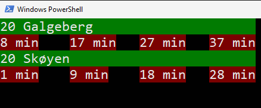

# Entur App
Using entur.org API to fetch the real-time status of my most used buses.
The buses, each with 3-4 bus schedules, are printed to the terminal using basic color pallets for a neat experience. 

It is intended to run on a raspberrypi using a 3.5" display. 

## Usage
Run in terminal: `python3 main.py`

## System
* Windows 10
* Python 3.7
    * pip install gql (used to fetch data using graphQL)